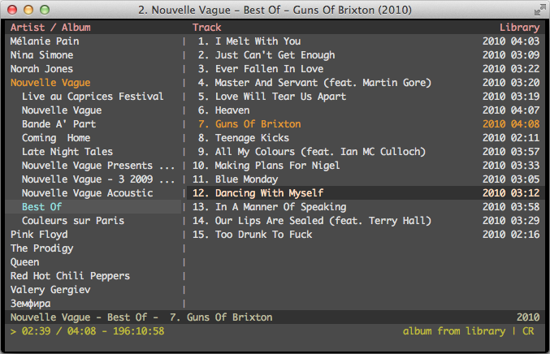

The music player `cmus` is wonderfully geeky with its command line interface. It starts up in a flash and is my new favourite way to play music on my laptop.<!-- more -->

I use <a href="https://en.wikipedia.org/wiki/Vi" target="_blank">vi</a> the text editor a significant amount at work so the controls for this came relatively easy. Their man pages are out of this world as well.



You can check it out at https://cmus.github.io/#home

Or download and install it to your mac it using:

```
brew install cmus
```
